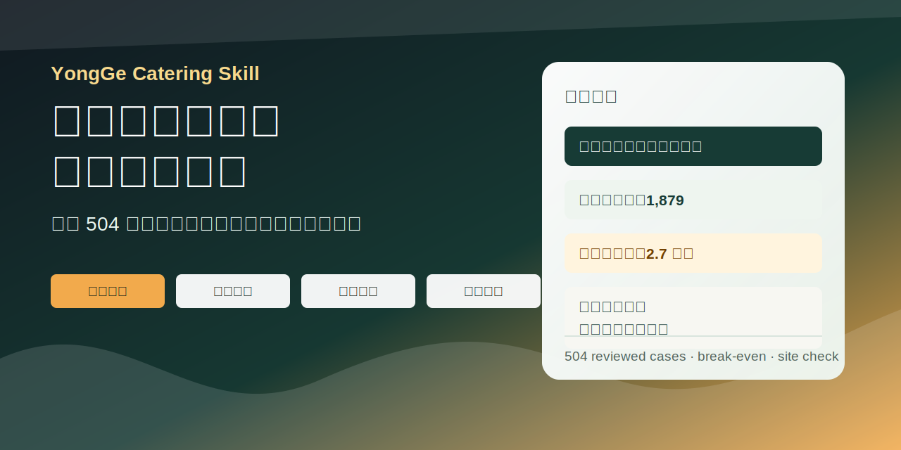
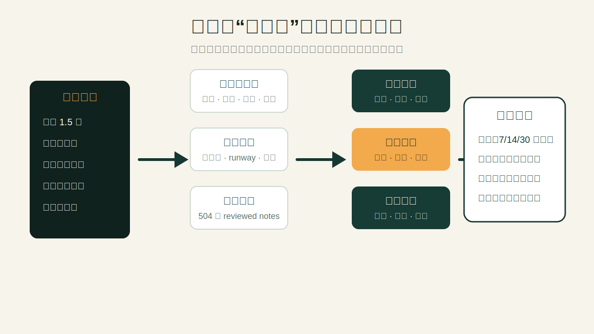
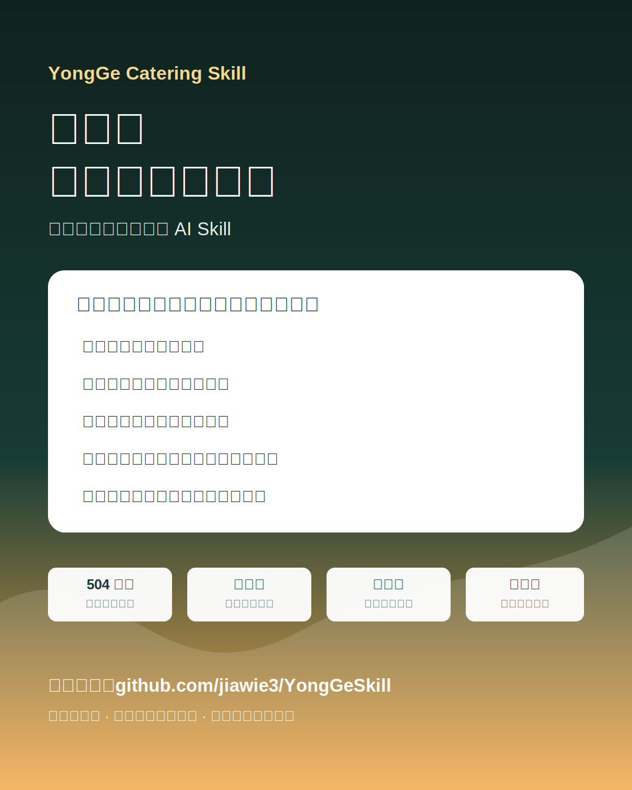

# 勇哥餐饮问诊 Skill

<p align="center">
  
</p>

把公开餐饮连麦案例里的“追问、算账、看位置、查加盟、劝止损”整理成一个可直接使用的 Codex Skill。

它适合问这些问题：

- “我店开了 3 个月，每月亏 1.5 万，怎么救？”
- “总部说半年回本，现在让我先交 5 万定金，能不能加盟？”
- “我拍了店门口和高德截图，这个位置能不能做汉堡炸鸡？”
- “转让费 8 万，老板说一天能卖 3000，这店能不能接？”

它不会一上来就让你投流、发传单、做活动。它会先问最关键的数：租金、人工、日流水、毛利率、剩余现金、合同主体、点位动线。然后算保本线，找出真正卡住你的地方，最后给一个明确方向：能救就怎么测，不能救就怎么止损，没查清就先别签、别交钱。

<p align="center">
  
</p>

## 它能做什么

**亏损门店诊断**

开业几个月一直亏，先算每天要卖多少才能保本，再看问题是点位、租金、人工、毛利、外卖平台，还是老板自己没法守店。

**开店前冷静拦一下**

如果你是第一次开店、还要借钱、还没算清租金和毛利，它会先把风险摊开，而不是顺着“我想试试”的情绪往前推。

**加盟和快招品牌风险检查**

用户说出具体品牌或公司时，Skill 会要求核对品牌名、总部公司、合同甲方、收款主体、发票主体、直营店和公开资质。需要当前信息时，应联网查公开来源再判断。

**店铺照片和地图截图分析**

用户上传门头照片、周边街景、高德/百度地图截图时，Skill 会先看图里能确认的东西：门头是否清楚、顾客是否自然经过、左右邻店和对面是什么、地图上有没有竞品和真实动线。

**接盘转让和合伙风险**

转让费是不是买到了真实客流？收款截图能不能信？房东是否同意重签？证照、油烟、消防能不能过？合伙人谁守店、谁管钱、亏损怎么扛？这些都会被拆开问。

## 为什么它值得用

这个项目不是简单模仿语气，也不是把几条标题凑成知识库。它真正有用的地方在于：把大量公开案例里反复出现的问诊套路整理成了稳定流程。

- 覆盖 504 条公开案例。
- 整理了约 166.9 小时公开视频内容。
- 每条案例都抽取了用户情况、追问顺序、计算逻辑、诊断和建议。
- 运行时可以检索相似案例，也可以用脚本快速算保本线。

简单说，它学的不是“说话像不像”，而是“遇到一个餐饮问题时，先问什么、怎么算、该怎么判断”。

## 公开来源参考

本项目基于公开网络资料和公开视频案例做方法蒸馏。下面是公开 Bilibili 账号入口，方便读者理解来源语境。本仓库不是官方项目，也不代表账号本人立场。

| 公开账号 | 入口 | 说明 |
| --- | --- | --- |
|  | [勇哥餐饮原创](https://space.bilibili.com/3546801669933097) | B 站公开资料显示为“勇哥餐饮创业说官方账号”。 |
|  | [勇哥餐饮避坑指南](https://space.bilibili.com/37938807) | B 站公开资料显示其签名提示“已授权”，并引导搜索 `@勇哥餐饮原创` 连麦。 |

> 头像为公开账号图片的远程引用，只用于说明资料来源。商业投放或大规模宣传时，建议使用本仓库自制视觉图，不要把未授权人物肖像、视频截图或直播片段作为主视觉。

## 如何安装

把仓库 clone 到 Codex 的 skills 目录：

```bash
mkdir -p ~/.codex/skills
git clone git@github.com:jiawie3/YongGeSkill.git ~/.codex/skills/yongge-catering-skill
```

如果不用 SSH，也可以用 HTTPS：

```bash
mkdir -p ~/.codex/skills
git clone https://github.com/jiawie3/YongGeSkill.git ~/.codex/skills/yongge-catering-skill
```

然后新开 Codex 会话，直接这样问：

```text
使用 $yongge-catering-skill 帮我分析：我店开了3个月，每月亏1.5万，怎么救？
```

## 怎么问效果最好

如果你已经开店亏钱，尽量一次性给这些信息：

```text
城市/商圈：
品类/是否加盟：
开业多久：
总投入/剩余现金/负债：
月租+物业：
人工人数+工资：
日均流水/客单/日单量：
毛利率或食材成本率：
堂食/外卖占比：
每月亏损：
竞品和位置问题：
```

如果你还没签约或准备加盟，尽量给：

```text
品牌名：
总部公司全称：
合同甲方：
收款主体：
加盟费/保证金/设备费/物料费：
是否已签合同或付款：
总部承诺了什么：
直营店地址：
```

如果你想让它看位置，可以上传：

```text
门口正面照片
左边照片
右边照片
对面照片
高德/百度地图截图或位置链接
月租、面积、品类、预计/当前流水、毛利率
```

## 使用示例

### 1. 亏损门店

```text
使用 $yongge-catering-skill
三线城市社区底商，汉堡炸鸡加盟，开业3个月。总投28万，剩现金3万，负债12万。
月租1.2万，2个员工工资共1.4万，水电3000，其他固定2000。
日均流水1200，毛利55%，每月亏1.3万，堂食为主。这个店怎么救？
```

它会先算：固定成本多少、日保本流水多少、现在每天差多少、现金还能撑多久。再判断这个店是可以短期测试，还是结构上已经很危险。

### 2. 加盟品牌

```text
使用 $yongge-catering-skill
我想加盟某某奶茶，总部说半年回本，现在让我先交5万定金。能不能签？
```

它不会只听“半年回本”。它会先要品牌全称、总部公司、合同甲方、收款账户、直营网点和总部承诺。涉及具体品牌时，还应该联网查公开资质和纠纷信息。

### 3. 选址照片或地图截图

```text
使用 $yongge-catering-skill
我上传了店门口照片和高德地图截图，这个位置能不能做炸鸡汉堡？
```

它会先分清哪些是图片里能确认的，哪些只是猜测。比如门头是否清楚、顾客是否能自然经过、对面人流能不能过来、周边竞品是否更强。

### 4. 接盘转让

```text
使用 $yongge-catering-skill
我和表哥想接一个学校旁边的炸串店，转让费8万，房租9000一个月。
老板说一天能卖3000，但只给我看了几张收款截图。我们还没签，只交了2000定金。
```

它会优先提醒你：现在只交了 2000 定金，这是最便宜的止损窗口。然后再拆转让费、后台流水、房东合同、证照、油烟消防和合伙规则。

## 这个 Skill 是怎么做出来的

制作这个项目时，我们没有只看“勇哥说话像什么风格”，而是看公开视频里一通真实问诊通常怎么展开。

我们关心的是这些东西：

- 咨询者一开始怎么描述问题。
- 勇哥通常先追问哪些数字。
- 他会把哪些成本换算成每天多少钱。
- 哪些情况会被判断为还能救。
- 哪些情况会被判断为应该止损。
- 加盟、接盘、选址、合伙这些坑通常怎么暴露出来。

然后把这些内容整理成两层：

1. **案例层**：504 条精修案例笔记，放在 `corpus/reviewed-case-notes/`。
2. **方法层**：把反复出现的判断方法整理到 `references/`，比如亏损门店怎么问、加盟品牌怎么查、地图照片怎么看、接盘转让怎么拆。

这样做的好处是：Skill 不需要背几句固定话术，而是能根据用户给出的数字和场景，走一套相对稳定的问诊流程。

## 仓库里有什么

```text
.
├── SKILL.md
├── agents/
│   └── openai.yaml
├── assets/
│   └── readme/
├── corpus/
│   └── reviewed-case-notes/
├── references/
│   ├── diagnostic-protocol.md
│   ├── decision-models.md
│   ├── franchise-due-diligence.md
│   ├── visual-site-analysis.md
│   ├── pre-signing-risk-checks.md
│   ├── dialogue-derived-cases.md
│   ├── case-patterns.md
│   ├── usage-examples.md
│   └── source-map.md
└── scripts/
    ├── restaurant_break_even.py
    ├── search_reviewed_cases.py
    ├── corpus_status.py
    ├── run_review_corpus.py
    └── bilibili_corpus_pipeline.py
```

发布包保留的是运行 Skill 需要的内容：入口文件、方法文档、精修案例笔记、算账和检索脚本。原始音频、原始转写文件、机器初稿和运行日志没有放进仓库。

## 常用脚本

检索相似案例：

```bash
python scripts/search_reviewed_cases.py "汉堡 加盟 月亏 房租 毛利"
```

计算保本线：

```bash
python scripts/restaurant_break_even.py \
  --daily-sales 1200 \
  --rent 12000 \
  --labor 14000 \
  --utilities 3000 \
  --other-fixed 2000 \
  --gross-margin 55 \
  --cash 30000
```

示例输出：

```text
餐饮保本线测算
- 月固定成本：31,000
- 贡献毛利率：55.0%
- 月保本流水：56,364
- 日保本流水：1,879
- 当前月流水：36,000
- 预估月利润：-11,200
- 距离日保本差额：679
- 现金还能撑：2.7 个月
```

## 展示素材

仓库里放了几张自制展示图，可以用于 README 或普通分享：

- `assets/readme/hero.svg`
- `assets/readme/feature-map.svg`
- `assets/readme/social-card.svg`

<p align="center">
  
</p>

## 重要边界

- 这不是勇哥本人，也不是官方账号。
- 本项目基于公开内容做方法蒸馏，不冒充、不中伤、不编造原话。
- 经营建议不能保证赚钱。
- 加盟纠纷建议不能替代正式法律意见。
- 对具体品牌、公司、备案、诉讼、投诉、地图位置等当前信息，使用时应联网核验并引用来源。
- 公开来源可能有缺失、下架、登录限制或验证码限制，查不到不等于事实不存在。

## 一句话总结

餐饮最怕“感觉能干”。这个 Skill 的作用，就是在你签合同、交加盟费、接盘转让、继续烧钱之前，先帮你把账算一遍，把坑照出来，把下一步动作说清楚。
